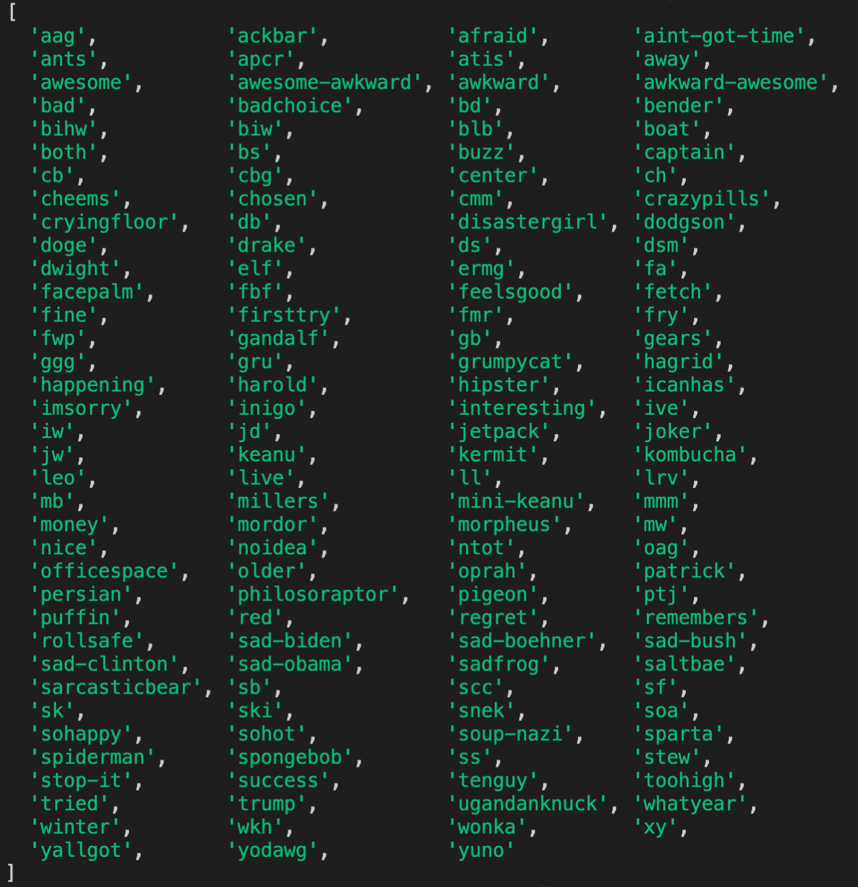
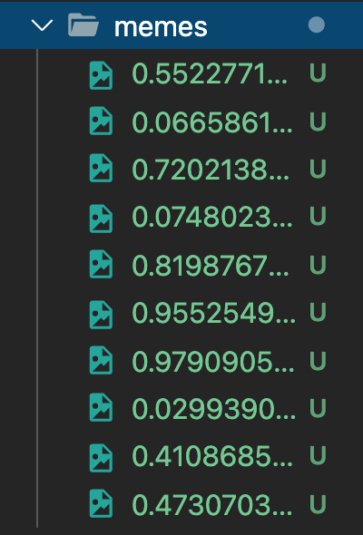
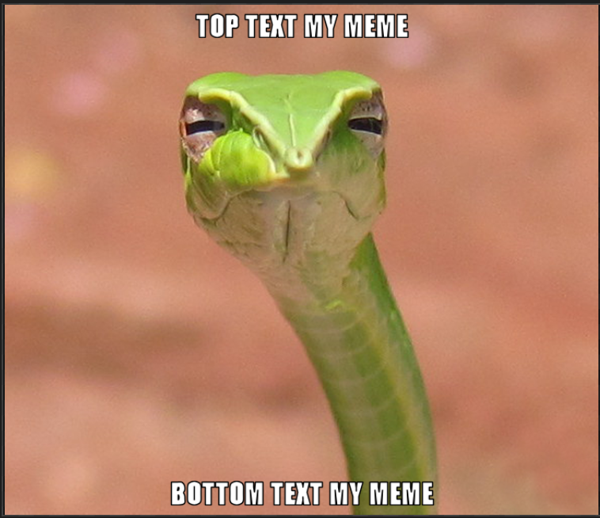

# Meme Generator and Scraper

An application that scrapes this website:

https://memegen-link-examples-upleveled.netlify.app/

and saves the first 10 images into a folder called "memes" within the directory of the new project.

It can also create your own meme by providing the top and bottom text and the meme (slug) name.

## Installation

Use the package manager [yarn](https://yarnpkg.com/) to install the dependencies.

```bash
yarn install
```

## Usage

```
node index.js --help
```

It lists all the meme names fetched from https://api.memegen.link/templates. You can also check which meme slug name belongs to which meme on the previously provided API link.



```
node index.js
```

Scrapes the first 10 images into a folder called "memes"



```
node index.js top-text-my-meme bottom-text-my-meme snek
```

After providing the top and bottom text and name of the meme, it will create it for you and save it to 'my-memes' folder.


